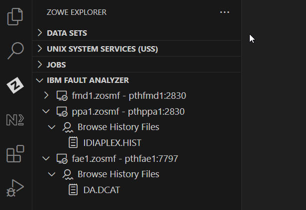
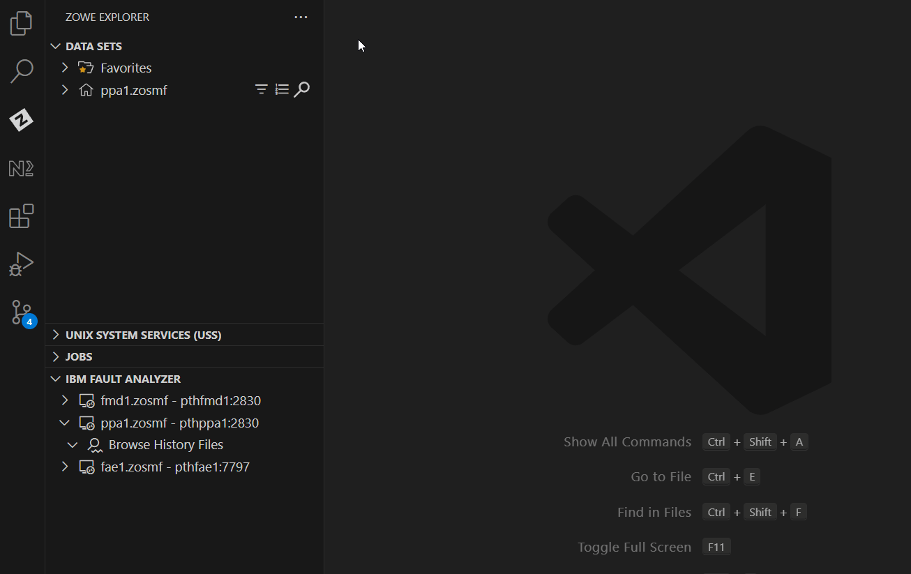
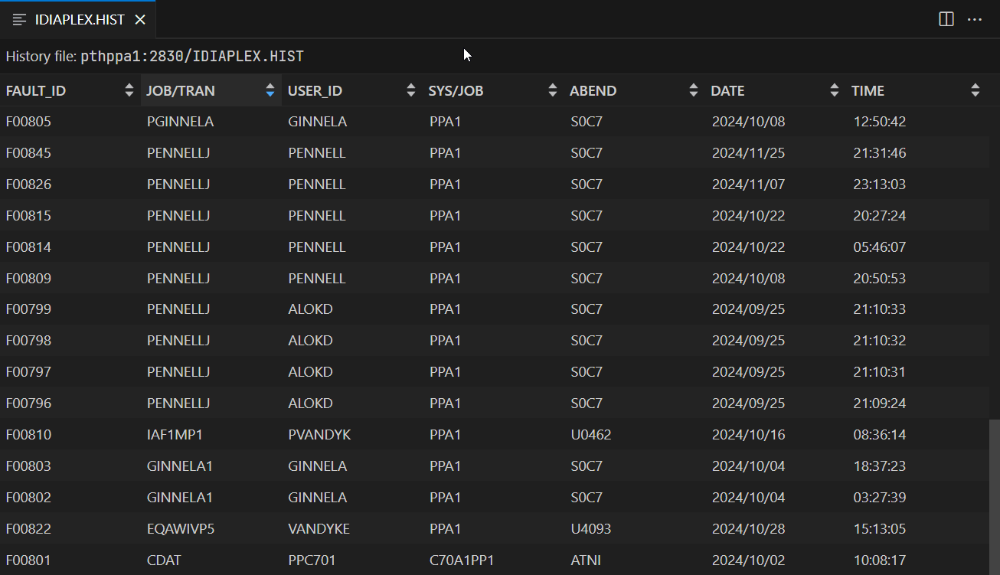
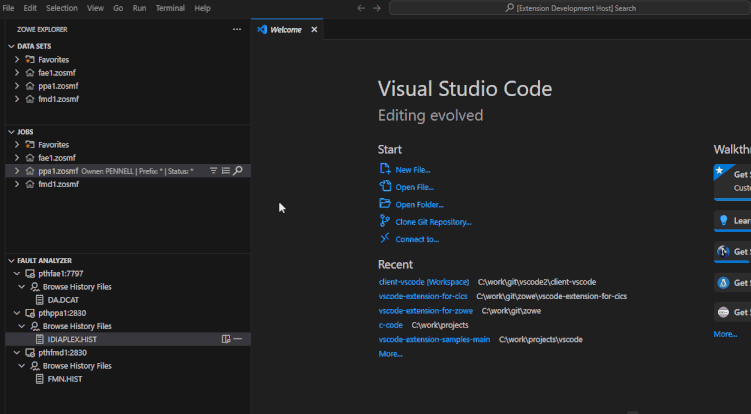
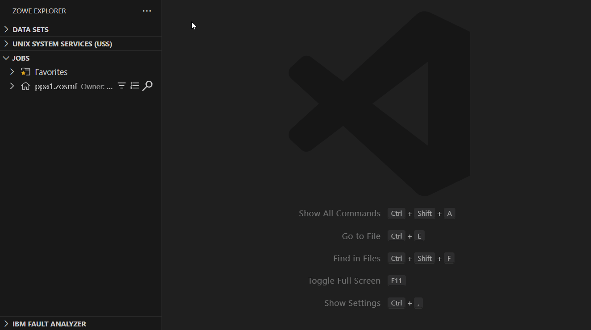
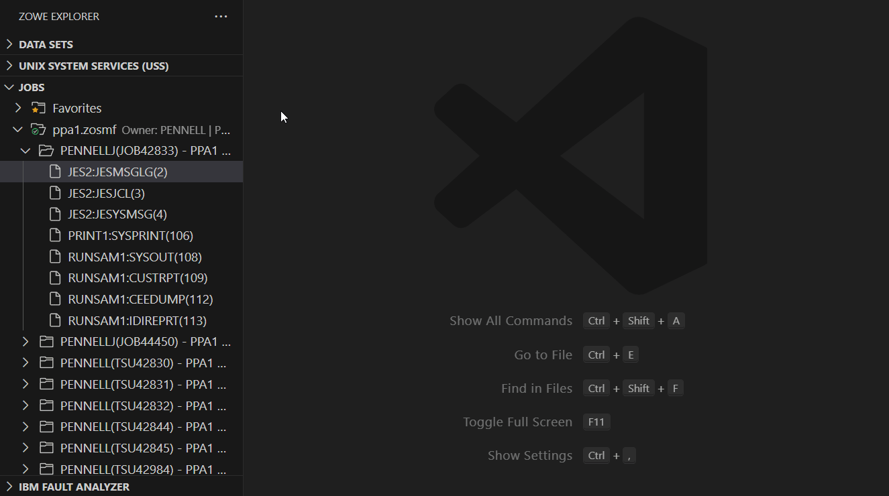
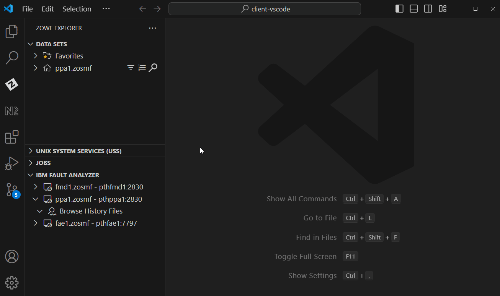
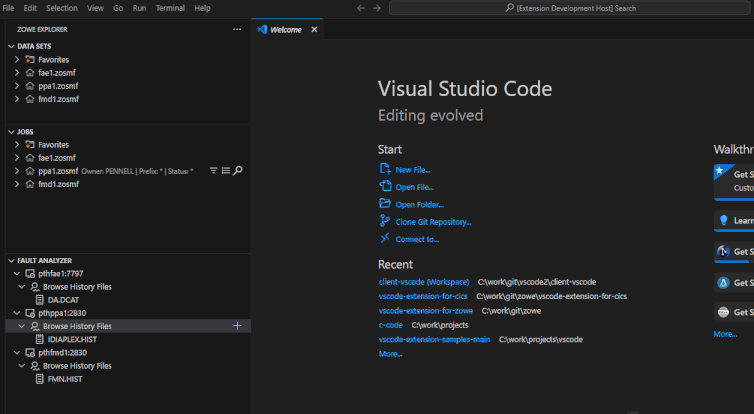
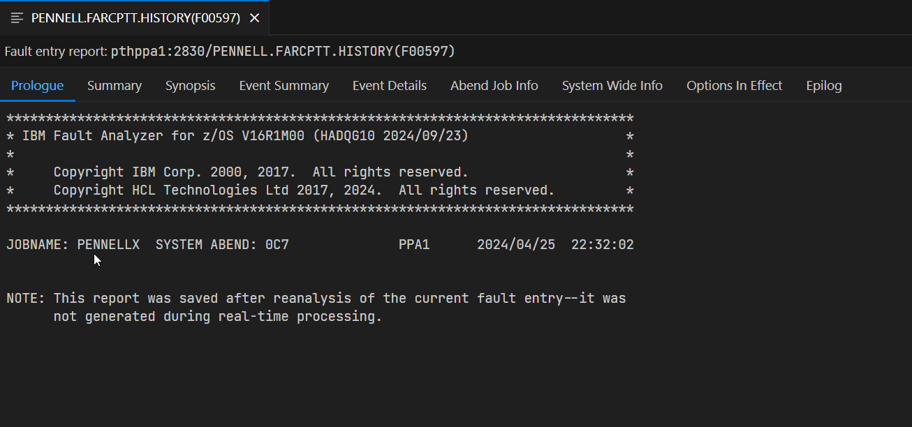

# IBM Fault Analyzer for z/OS&reg;

[][link-fa-vsc-issues]
[][link-ext-pack]
[][link-support]

The IBM Fault Analyzer for z/OS&reg; VS Code extension works in conjunction with the
[Zowe Explorer][link-zowe] VS Code extension. IBM Fault Analyzer for z/OS&reg; helps
developers analyze and fix application and system failures.

When applications abnormally end (ABEND), it is crucial to understand the root cause.
IBM Fault Analyzer for z/OS&reg; can discover ABENDs faster, more confidently, and in less time
by automatically gathering real-time information of the ABEND and the environment at the time of failure.

> Simplify your installation experience by using newly bundled extension packs that contain
> IBM Fault Analyzer for z/OS as well as other extensions available for [ADFz][link-ext-pack] customers.

## Table of contents

- [General requirements](#general-requirements)
- [Host requirements](#host-requirements)
- [VS Code requirements](#vs-code-requirements)
- [Integration with Zowe Explorer](#integration-with-zowe-explorer)
- [Optional VS Code extensions](#optional-vs-code-extensions)
- [Features](#features)
- [Unsupported features](#unsupported-features)
- [Getting started](#getting-started)
- [Getting help](#getting-help)

## General requirements

- Assumes knowledge of the IBM Fault Analyzer for z/OS&reg; product [installation][link-fa-install]
  and [features][link-features].
- The Fault Analyzer VS Code extension connectivity to the Fault Analyzer host is similar to using
  the Application Delivery Foundation for z/OS&reg; Common Component (ADFzCC) server:
  - Assumes knowledge of how to [install][link-adfz-install] and [configure][link-adfz-config]
    the ADFz Common Component server.
  - [ADFz Common Component][link-adfz-customize] must use the [AT-TLS][link-adfz-attls] feature
    when configuring TLS support.

## Host requirements

- [IBM Fault Analyzer for z/OS&reg;][link-fa] `16.1.0`+
- [IBM Application Delivery Foundation for z/OS&reg; Common Component][link-adfz-docs] `1.10.0`+
  - You must configure and deploy at least one ADFz Common Component server on the host you intend
    to use with the extension.

## VS Code requirements

- [VS Code][link-vscode] `1.101.0`+
- [Zowe Explorer][link-zowe] `3.2.0`+
  - Assumes the user is familiar with the Zowe Explorer extension before using the IBM Fault Analyzer extension.

## Integration with Zowe Explorer

The IBM Fault Analyzer extension builds on the strong foundation provided by Zowe Explorer.
To preserve the familiar Zowe Explorer user experience, it purposefully avoids contributing highly
customized UI elements whenever possible. Instead, it enhances your current workspace by:

- Reusing your Zowe profiles configuration to manage local and remote resources.
- Adding new functionality directly to Zowe Explorer's existing **Data Sets** and **Jobs** views.
- Integrating specialized views directly into Zowe Explorer's existing tool windows.

See the [Getting help](#zowe-explorer-issues) section to report issues related to the Zowe Explorer extension.

## Optional VS Code extensions

- [IBM Z&reg; Open Editor][link-open-editor]
  - Provides color-coded sources when viewing side files in fault reports.
  - Provides color-coded job spool data sets.

## Features

The current version of the IBM Fault Analyzer extension does not support all features available
in the ISPF or Eclipse Fault Analyzer clients.

The following list provides a high-level overview of the features that are supported and unsupported
in the extension.

### Supported character sets

The extension supports resources in both English (`IBM1047`) and Japanese (`IBM939`).

Use the **IBM Fault Analyzer** > **Language** setting to configure the global resource language.

### History files

- Open history files in a separate view.
- Customize visible columns in the history files view.
- Filter visible fault reports using individual column filters.
- Add history files to the Fault Analyzer tree view:
  - From the Zowe Data Sets tree view
  - From the Fault Analyzer tree view
  - From the Command Palette
- Remove history files from the Fault Analyzer tree view.

### Fault reports

- Reanalyze and display fault reports in a separate view:
  - From the context menu of the history file view, or by clicking on a fault entry reference
  - From the context menu of a job in the Zowe Jobs tree view
  - From a job JESMSGLG editor as hyperlinks, and from the context menu
  - From the Command Palette
- Navigate to sections of the report:
  - Event Detail hyperlinks to jump to a specific event definition
  - Source code hyperlinks to open a source file at a designated line

### ADFz Common Component connections

- Associate an ADFz Common Component connection with a Zowe profile.
- Remove the association between an ADFz Common Component connection and a Zowe profile.

## Unsupported features

### Secure connections

- Trust manager for certificates that are used to connect to the ADFz Common Component server.

### History files

- Add default and recent history files.
- Copy/Rename/Remove fault entries from the history file.
- Choose column ordering.
- View fault entry properties.

### Fault reports

- Side files:
  - IDITrace logs
  - JCL for the job causing the ABEND
  - Minidump
- Hyperlinks:
  - Lookup view links for viewing ABEND explanations
  - Memory links jumping to minidump
  - CICS links

### Views

- Add view
- Create view
- Display and navigate views

### Fault analytics

- Manage and display charts

## Getting started

### Configuring the ADFz Common Component connection

Before you begin, all preceding requirements must be satisfied.

1. Open VS Code.
2. If necessary, create at least one Zowe profile: team configuration profile or v1 profile (deprecated).
3. Switch to the Zowe Explorer tool window.
4. Right-click on the profile that matches the z/OS subsystem where your ADFz Common Component server runs.
5. From the **Application Delivery Foundation for z/OS** menu item, select **Configure connection**.
6. Enter the connection information for the ADFz Common Component server.

You are now ready to use the IBM Fault Analyzer VS Code extension.

> Note: if you access a Fault Analyzer feature before configuring the ADFz Common Component connection,
> you are prompted to provide the required connection information. This prompt occurs only during the
> first access.

### The Fault Analyzer tree

When the Zowe Explorer tool window is selected in VS Code, the tool window contains three default tree views:
**Data Sets**, **Unix System Services**, and **Jobs**.

The IBM Fault Analyzer extension adds a tree view, **IBM Fault Analyzer**, to manage the addition of history files.
When you associate an ADFz Common Component connection with a profile, the connection displays in the
**IBM Fault Analyzer** tree view.

### Tree structure

#### Connection nodes

A root node in the tree view displays each ADFz Common Component host and port connection.

#### History Files nodes

These are the parent nodes for the history files associated with the connection.

- Click the **Add History File** inline button or select the option from the context menu to provide
  a data set name. This action opens the new history file and adds it to the tree view.

#### History File nodes

These nodes represent the history files that are associated with the connection.

- Click the **Open History File** inline button or select the option from the context menu to open
  the history file. If the file is already option, this action puts it into focus.
- Click the **Remove History File** inline button or select the option from the context menu to remove
  the history file from the **IBM Fault Analyzer** tree.

### Opening history files from the Zowe Explorer Data Sets tree

History files can also be added from the Zowe Explorer **Data Sets** tree:

1. In the Zowe Explorer **Data Sets** tree view, click the **Search Data Sets** inline button or select
   the option from the context menu item for a specific profile.
2. Select an existing filter or create a new filter to display the history file that you want to add to
   the **IBM Fault Analyzer** tree view.
3. Right-click the history file and select **IBM Fault Analyzer** > **Open History File**.
4. If an ADFz Common Component connection is not yet defined for this profile, provide the connection
   information when prompted. A new connection is created in the **IBM Fault Analyzer** tree view.
5. The history file is opened in a new tab and is displayed in the **IBM Fault Analyzer** tree view if
   it does not already exist.

### Viewing fault reports from a history file

To view a history file, click the entry in the **IBM Fault Analyzer** tree view.
To open a fault report from a displayed history file, either double-click a fault entry row or,
from the context menu on a fault entry row, select **Reanalyze**.

### Viewing fault reports from the Zowe Explorer Jobs tree

When a job generates one or more ABENDs, you can display the fault report from the Zowe Explorer
**Jobs** tree view by using any of the following methods:

#### From the Jobs tree node

1. Right-click the job that completed with an ABEND.
2. Select **IBM Fault Analyzer** > **Open Fault Report**.

   > Note: if a job has more than one ABEND, you are prompted to select the fault report you want to open.

#### From a job JESMSGLG output data set (hyperlinks)

1. Expand the tree node for the job that ended with an ABEND.
2. Click on the **JES2:JESMSGLG** output data set to open it.
3. Hyperlinks display for each ABEND. To open the fault report for an ABEND, hold `CTRL` and click the
   associated hyperlink.

#### From a job JESMSGLG output data set (context menu)

1. Expand the tree node for the job that ended with an ABEND.
2. Click on the **JES2:JESMSGLG** output data set to open it.
3. Open the editor context menu and select **Open Fault Report**.

### Command Palette commands

The IBM Fault Analyzer extension adds new commands to the VS Code Command Palette.

#### Open History File

This command adds a history file to the **IBM Fault Analyzer** tree view in the Zowe Explorer tool window.
When you select this command, you are prompted to provide the following information:

- A Zowe profile. If multiple profiles are defined, select a profile that has an associated
  ADFz Common Component connection.
- A data set name. Specify the name of the history file you want to open and add to the **IBM Fault Analyzer**
  tree view.

#### Open Fault Report

This command reanalyzes and opens a fault report. When you select this command, you are prompted to provide
the following information:

- A Zowe profile. If multiple profiles are defined, select a profile that has an associated
  ADFz Common Component connection.
- The data set name. Specify the name of the history file that contains the fault entry you want
  to reanalyze and open.
- The fault entry ID. Specify the ID of the report you want to reanalyze and open.

### Overview of the Fault Report view

The Fault Report view is a collection of tabs that provide access to the different sections of the report.

Some sections contain hyperlinks that you can use to open source files at a specific line number.  
In the **Event Details** section, you can click event hyperlinks to jump to specific event definitions
in another section.

The layout is modeled after the Fault Reports view in the IBM Fault Analyzer Eclipse client.

## Getting help

To ask questions or report issues related to the installation, configuration,
or use of this extension, contact [IBM Support][link-support].

### Zowe Explorer issues

The IBM Fault Analyzer extension depends on Zowe Explorer.  
Issues might originate from core Zowe Explorer functionality rather than the extension itself.
Examples include:

- Data set and Unix System Services (USS) file browsing
- Job management and submission
- Base Zowe Explorer commands and views

Report issues that are specific to Zowe Explorer to the Zowe Explorer [issue tracker][link-zowe-support].

To determine the source of an issue and the appropriate reporting channel, consider the following:

- Error notifications include the extension name.
- Log entries displayed in the **Output** view are categorized by extension.

[link-vscode]: https://code.visualstudio.com
[link-zowe]: https://marketplace.visualstudio.com/items?itemName=Zowe.vscode-extension-for-zowe
[link-open-editor]: https://marketplace.visualstudio.com/items?itemName=IBM.zopeneditor
[link-fa-vsc-issues]: https://github.com/IBM/fa-vs-code-extension/issues
[link-fa]: https://www.ibm.com/products/fault-analyzer-for-zos
[link-fa-install]: https://help.blueproddoc.com/faultanalyzer/hadqg10_FA_Program_Directory_V161.pdf
[link-features]: https://help.blueproddoc.com/faultanalyzer/16.1.0/en/index.html
[link-adfz-docs]: https://help.blueproddoc.com/adfz_common_components/welcome/index.html
[link-adfz-install]: https://help.blueproddoc.com/adfz_common_components/hvwr1a0_ADFzCC_Program_Directory_V1.10.pdf
[link-adfz-config]: https://help.blueproddoc.com/adfz_common_components/1.10.0/en/index.html
[link-adfz-customize]: https://help.blueproddoc.com/adfz_common_components/1.10.0/en/svrauth.html
[link-adfz-attls]: https://help.blueproddoc.com/adfz_common_components/1.10.0/en/attls.html
[link-ext-pack]: https://marketplace.visualstudio.com/items?itemName=IBM.application-delivery-foundation-for-zos-vscode-extension-pack
[link-support]: https://www.ibm.com/mysupport/
[link-zowe-support]: https://github.com/zowe/zowe-explorer-vscode/issues
