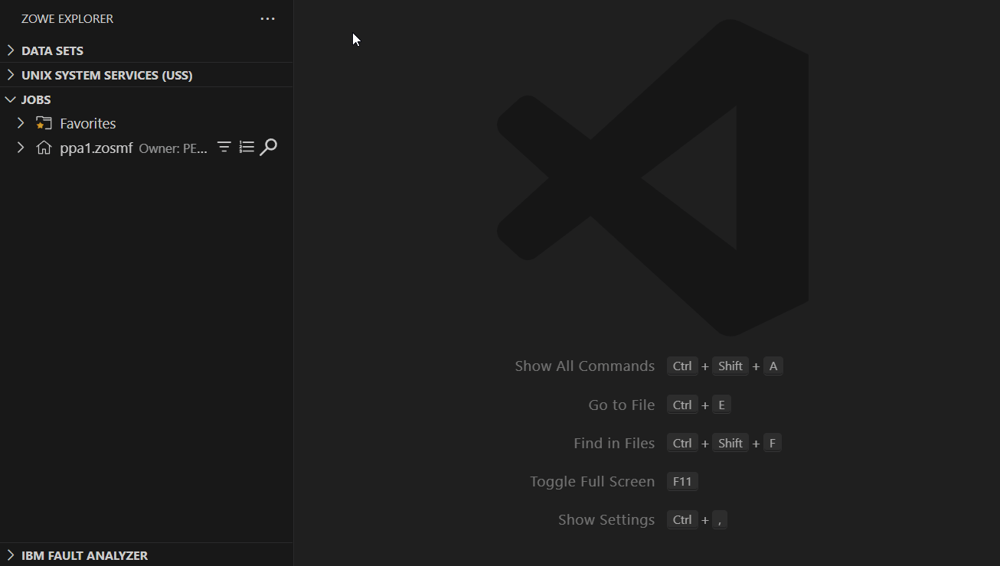

# IBM Fault Analyzer for z/OS&reg;

The IBM Fault Analyzer for z/OS&reg; VS Code extension works in conjunction with the [Zowe Explorer][link-zowe] VS Code extension.
IBM Fault Analyzer for z/OS&reg; helps developers analyze and fix application and system failures.

When applications abnormally end (ABEND) it is crucial to understand the root-cause.
IBM Fault Analyzer for z/OS&reg; can discover ABENDs faster, more confidently, and in less time
by automatically harvesting real-time information of the ABEND and its environment at the time of failure.

**Simplify your installation experience by using newly bundled extension packs that contain IBM Fault Analyzer for z/OS
as well as other extensions available for [ADFz][link-ext-pack] customers.**

## General requirements

- Assumes knowledge of IBM Fault Analyzer for z/OS&reg; product [installation][link-fa-install] and [features][link-features]
- The Fault Analyzer VS Code extension connectivity to the Fault Analyzer host is similar to using
  the Application Delivery Foundation for z/OS&reg; Common Component (ADFzCC) server
  - Assumes knowledge of how to [install][link-adfz-install] and [configure][link-adfz-config] the ADFz Common Component server
  - [ADFz Common Component][link-adfz-customize] must use the [AT-TLS][link-adfz-attls] feature when configuring TLS support

## VS Code extension requirements

- [VS Code][link-vscode] `1.90.0`+
- [Zowe Explorer][link-zowe] `3.1.0`+
  - Assumes that the user has knowledge of the Zowe Explorer extension before using the IBM Fault Analyzer extension

## Optional VS Code extensions

- [IBM Z&reg; Open Editor][link-open-editor]
  - Provides color coded sources when viewing side files in fault reports
  - Provides color coded job spool data sets

## Host requirements

- [IBM Fault Analyzer for z/OS&reg;][link-fa] `16.1.0`+
- [IBM Application Delivery Foundation for z/OS&reg; Common Components][link-adfz-docs] `1.10.0`+
  - There must be at least one ADFz Common Component server configured and deployed
    on the host that you want to work with

Note that while `15.1.x` host builds might work, they are **not** officially supported.

### Supported charsets

The extension supports resources in both English (`IBM1047`) and Japanese (`IBM939`).

Use the **IBM Fault Analyzer** > **Language** setting to configure the global resource language.

## Features

The current version of the IBM Fault Analyzer extension does not support the full
functionality of the ISPF Fault Analyzer client, or of the Eclipse Fault Analyzer client.

Itemized below are the features supported and not supported in broad terms.

### History files

- Open history files in a separate view
- Add history files to the Fault Analyzer tree view:
  - From the Zowe Data Sets tree view
  - From the Fault Analyzer tree view
  - From the Command Palette
- Remove history files from the Fault Analyzer tree view

### Fault reports

- Reanalyze and show fault reports in a separate view:
  - From the history file view's context menu, or by clicking on a fault entry reference
  - From a job context menu in the Zowe Jobs tree view
  - From a job JESMSGLG editor as hyperlinks, and from the context menu
  - From the Command Palette
- Navigate to sections of the report:
  - Event Detail hyperlinks to jump to a specific event
  - Source code hyperlinks to open a source file at a specific line

### ADFz Common Component connections

- Associate an ADFz Common Component connection with a Zowe Profile
- Remove the association between an ADFz Common Component connection and a Zowe profile

## Unsupported features

- Trust manager for certificates used when connecting to the ADFz Common Component server

### History files

- Add default and recent history files
- Copy/Rename/Remove fault entries from the history file
- Filter fault entries
- Choose column ordering and visibility
- View fault entry properties

### Fault reports

- Side files:
  - IDITrace logs
  - JCL for the job causing the ABEND
  - Minidump
- Hyperlinks:
  - Lookup view links for viewing ABEND explanations
  - Data set links
  - Memory links jumping to minidump
  - CICS links

### Views

- Add view
- Create view
- Show and navigate views

### Fault analytics

- Manage and display charts

# Getting started

## Configuring the ADFz Common Component connection

Before you begin, all the above requirements must be fulfilled.

1. Open VS Code
2. If necessary, create at least one Zowe profile: team configuration profile or v1 profile (deprecated)
3. Switch to the Zowe Explorer toolwindow
4. Right-click on the profile that matches the z/OS subsystem your ADFz Common Component server is running on
5. From the **Application Delivery Foundation for z/OS** menu item, choose **Configure connection**
6. Enter the connection information for the ADFz Common Component server

You are now ready to use the IBM Fault Analyzer VS Code extension.

NOTE: if you access a Fault Analyzer feature before configuring the ADFz Common Component connection,
you will be prompted to specify the required information the first time only.

## The Fault Analyzer tree

When the Zowe Explorer toolwindow is selected in VS Code, the toolwindow has three tree views by default:
**Data Sets**, **Unix System Services**, and **Jobs**.

The Fault Analyzer extension adds a **Fault Analyzer** tree view as well to manage the history files that have been added.  
When an ADFz Common Component connection is associated with a profile, that connection will be displayed in the
**Fault Analyzer** tree view.

### Tree structure

#### Connection nodes

There will be one root node representing each host and port of an ADFz Common Component connection.

#### Browse History Files nodes

These are the parent nodes of any history file that have been added for the connection.

- The **Add history file** inline button (or context menu item) prompts for a data set name
  for a new history file to open and add to the tree

#### History file nodes

These are nodes representing a history file that has already been added.

- The **Open history file** inline button (or context menu item) opens the history file or reveals it if already open
- The **Remove history file** inline button (or context menu item) removes the history file from the **Fault Analyzer** tree

## Adding history files from the Zowe Explorer Data Sets tree

History Files can also be added from the Zowe Explorer **Data Sets** tree:

1. From a profile in the Zowe Explorer **Data Sets** tree, select its **Search Data Sets** inline button or context menu item
2. Select an existing filter or create a new filter that will show the history file that you want to open and add to the
   **Fault Analyzer** tree
3. From the context menu, select **Fault Analyzer** > **Add history file**
4. If an ADFz Common Component connection has not been configured for this profile, the required information
   will be prompted for and a new connection will be created in the **Fault Analyzer** tree
5. The history file will be added to the **Fault Analyzer** tree if it does not already exist in the tree, and will be
   opened in a new tab

## Viewing fault reports from a history file

Once a history file has been added to the Fault Analyzer tree, it can be displayed by clicking on it in the tree.  
Once the history file is displayed, you can open a fault report by double-clicking on a fault entry row.

An additional path to achieve the same result is to open the context menu over a fault entry row, and select **Reanalyze**.

## Viewing fault reports from the Zowe Explorer Jobs tree

When jobs that have generated one or more ABEND are viewed from the Zowe Explorer **Jobs** tree,
you will be able to view the fault report in multiple ways.

### From the Jobs tree node

1. Right-click on the job that completed with an ABEND
2. Select **Fault Analyzer** > **Open fault report**

   NOTE: if there is more than one ABEND in the job, you will be prompted
   to select which fault report you want to open

### From a job JESMSGLG output data set (hyperlinks)

1. Expand the tree node for the job that completed with an ABEND
2. Click on the **JES2:JESMSGLG** output data set to open it
3. Hyperlinks will be displayed for each ABEND that occurred.  
   Ctrl-clicking a hyperlink will open the fault report associated with the ABEND

### From a job JESMSGLG output data set (context menu)

1. Expand the tree node for the job that completed with an ABEND
2. Click on the **JES2:JESMSGLG** output data set to open it
3. Open the editor context menu, and select **Open fault report**

## Fault Analyzer commands

The Fault Analyzer extension adds new commands to the VS Code Command Palette.

### Add history file

Adds a history file to the **Fault Analyzer** tree in the Zowe Explorer toolwindow.  
You will be prompted for:

- A Zowe profile, if there is more than one defined, with an associated ADFz Common Component connection
- A data set name for the history file you want to open and add to the **Fault Analyzer** tree

### Open fault report

Performs reanalysis on a fault report and opens that report.  
You will be prompted for:

- A Zowe profile, if there is more than one defined, with an associated ADFz Common Component connection
- The data set name for the history file containing the fault entry you want to reanalyze and open
- The fault entry ID for the report you want to reanalyze and open

## Overview of the Fault Report view

The Fault Report view is a collection of tabs that enable the user to view different sections of the report.

Some sections have hyperlinks that will open source files at a specific line number.  
The **Event Details** section displays event hyperlinks to jump to the definition of the event in another section.

The layout is similar to the Fault Reports view in the IBM Fault Analyzer Eclipse client.

[link-vscode]: https://code.visualstudio.com
[link-zowe]: https://marketplace.visualstudio.com/items?itemName=Zowe.vscode-extension-for-zowe
[link-open-editor]: https://marketplace.visualstudio.com/items?itemName=IBM.zopeneditor
[link-fa]: https://www.ibm.com/products/fault-analyzer-for-zos
[link-fa-install]: https://help.blueproddoc.com/faultanalyzer/hadqg10_FA_Program_Directory_V161.pdf
[link-features]: https://help.blueproddoc.com/faultanalyzer/16.1.0/en/index.html
[link-adfz-docs]: https://help.blueproddoc.com/adfz_common_components/welcome/index.html
[link-adfz-install]: https://help.blueproddoc.com/adfz_common_components/hvwr1a0_ADFzCC_Program_Directory_V1.10.pdf
[link-adfz-config]: https://help.blueproddoc.com/adfz_common_components/1.10.0/en/index.html
[link-adfz-customize]: https://help.blueproddoc.com/adfz_common_components/1.10.0/en/svrauth.html
[link-adfz-attls]: https://help.blueproddoc.com/adfz_common_components/1.10.0/en/attls.html
[link-ext-pack]: https://marketplace.visualstudio.com/items?itemName=IBM.application-delivery-foundation-for-zos-vscode-extension-pack
